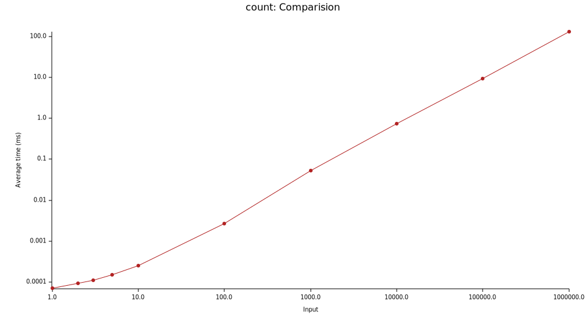

# python-inversion-number

## Install
```sh
pip install python_inversion_number
# or
https://github.com/elbaro/python-inversion-number.git
pip install .
```

## Usage
```py
import python_inversion_number
assert python_inversion_number.count([1,2,3]) == 0
assert python_inversion_number.count(np.array([3,1,2])) == 2
assert python_inversion_number.count(torch.tensor([1,2,3])) == 0
```

The argument can be any object with `__len__` and `__iter__`.

## Method
Memory: O(n)
Time: O(n lg n)

## Bench



```py
from sympy.combinatorics import Permutation
import numpy as np
import timeit

a = np.arange(1000000)
np.random.shuffle(a)
b = Permutation(a)
timeit.timeit(lambda: b.inversions(), number=10)
# >> 38.14018609099912

a = a+1
timeit.timeit(lambda: python_inversion_number.count(a), number=10)
# >> 14.66622285899939
```
